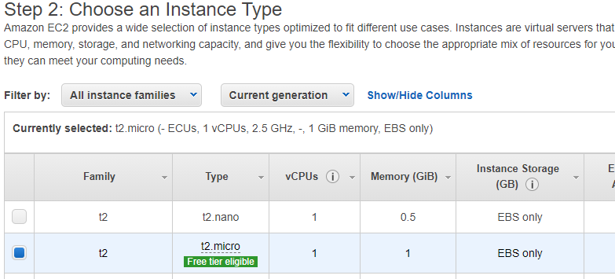
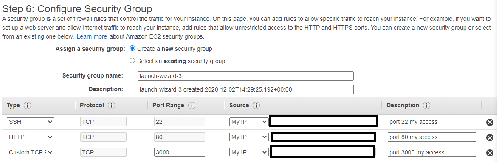
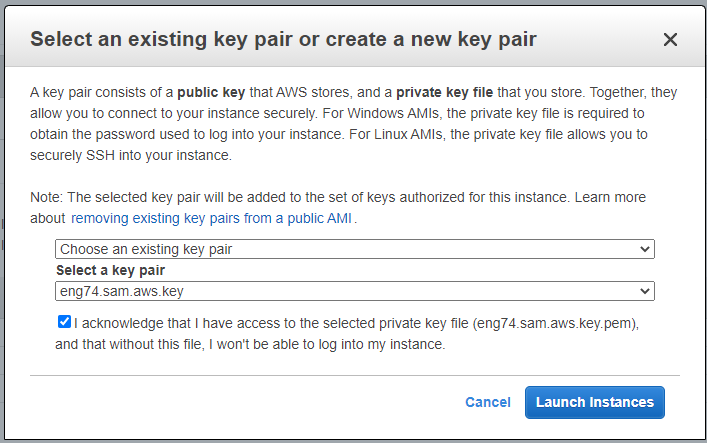

## What is EC2
```
- EC2, Elastic Compute Cloud is one of the services provided by AWS in the compute category.
- Provides virtual machines in the cloud. These are known as EC2 instances.
- Gives full control over the guest OS on each instance.
```

## Security Groups
```
- Security groups act as virtual firewalls for EC2 instances.
- Used to control incoming and outgoing traffic by defining rules for inbound and outbound traffic.
```
- Rules can only be 'allow' rules i.e. cannot deny.
```
To open a port  to your Ip you can add security groups when creating your aws instance and specify which ports you want to point towards your IP.
An inbound rule would be used open a port to a specific ip address. The source would be specified as 'My IP'.
Similarly, an inbound rule can also allow access to all ip addresses by having the source as 'Anywhere'. This is not advisable.
```

#### Port 22
- Should not be open to to all as it poses a serious security risk. 
- It can lead to multiple login attempts and if multi-factor authentication has not been enabled, the account is likely to be compromised.

## SSH 

SSH, or secure shell, is a secure protocol and the most common way of safely administering remote servers.
```
Using a number of encryption technologies, SSH provides a mechanism for 
- establishing a cryptographically secured connection between two parties, 
- authenticating each side to the other, 
- and passing commands and output back and forth.
```
## Task goals

- Create an EC2 instance on AWS and also a Jenkins job
- Set Jenkins trigger to successfull merge and publish of code automatically to the live EC2 server.

# Step by step instructions

## AWS EC2 instance
### 1st 
- Choose the OS you want to run
- We will choose from the free tier selection Ubuntu 18

### 2nd
- Choosing the instance type depends what you want to do on this server however we will choose the free 1CPU and 1GB ram.



### 3rd
- Configuring the instance details means we choose the network and the subnet.
- Auto assign public IP is set to enabled
- The network I am using is the DevOpsStudents default
- Most of the pther settings can remain as default

### 4th
- Select storage, default can be kept

### 5th
- Add a tag is to configure a name for our instance, and put the key as Name and the value as a logical server name.

### 6th
- We need to add a security group, so we can choose who can access our server instance.
- This should be named appropriately, or choose your security group
- A port is added to access the server with an ssh key
- Another port to access with my IP address in the URL
- Finally I added a custom tcp on port 3000, which is the development port of our app.



### 7th
- A summary of your server settings to ensure correctness.
- It should ask you to select an ssh key. 
- If you dont have one, click create a new key pair and name it appropriately, then save it in a safe place once you launch instances.



- If successful you will access a dashborad to view all existing instances.


--------------------------------------------------------------------

## Entering the EC2 instance
- Enter the folder where you saved your ssh key
- Enter the command
```
ssh -i <name of key> ubuntu@<your Public IP4 address>
```
- Your public ip address should be found in the detauls section on your AWS instance.
- Type yes in the terminal to continue connecting and you will enter the terminal of your EC2.

## Sending files to the EC2
- A file can sent to the VM with the following command
```bash
scp -i ~/.ssh/key -r <foldername> ubuntu@serverip:~/destination
```
- Large files/folder should be deleted other wise it will take too long to copy over.

- Add both the provision files to the server aswell
```
scp -i ~/.ssh/key <filename> ubuntu@serverip:~/destination
```

## Running the app in the EC2
- Follow path to the file named app.js
- Run the provision.sh file with the command
```
./../environment/app/provision.sh 
```

## Connect another EC2 instance as database
- Follow the steps above to create another EC2 server.
- 

#### For step 1 
```
Make your you find an ubuntu 16.04 os because the commands for setting up mongodb 3.2.2 work in a Xenial environment.
```
#### For step 6 
```
Only add the private security ssh port 22 and add a customn port 27017 which allows all to listen (ip 0.0.0.0)
```
- SSH into the instance and send in the database provision.sh file
- You can either use scp command to send the config file into the VM 
- or you can go into mongo.conf manually and change the bind ip to 0.0.0.0 using the sudo for permissions
- Now return to the APP EC2 server and run the following command
```
echo "export DB_HOST=<db server public ip>" >> ~/.bashrc
source ~/.bashrc
```
